# UML-диаграммы голосовой конференции

---

## 1. Диаграмма вариантов использования (Use Case)

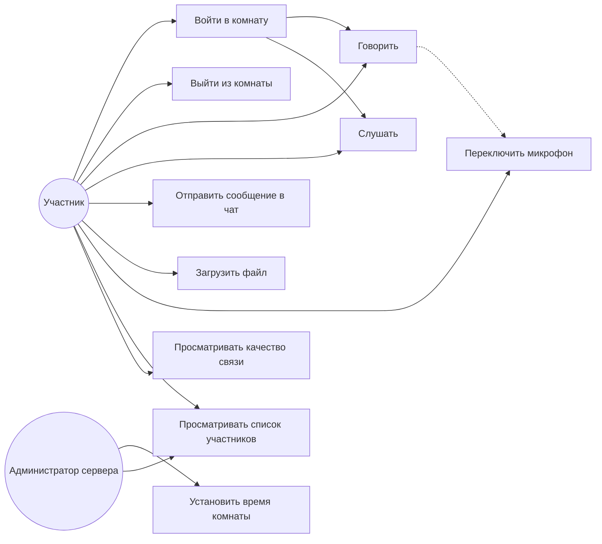

**Описание:** Участник может входить в комнату, говорить, слушать, отправлять сообщения, загружать файлы и переключать микрофон. Администратор устанавливает время жизни комнаты и просматривает участников.

---

## 2. Диаграмма классов (Class Diagram)

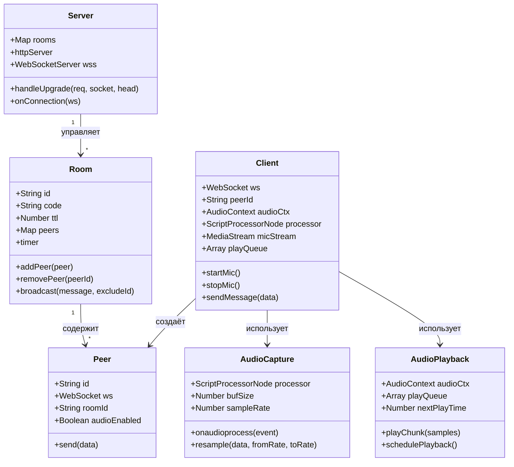

**Описание:** Сервер управляет комнатами, каждая комната содержит участников. Клиент создаёт Peer-объект и использует компоненты захвата и воспроизведения аудио.

---

## 3. Диаграмма последовательности — вход в комнату

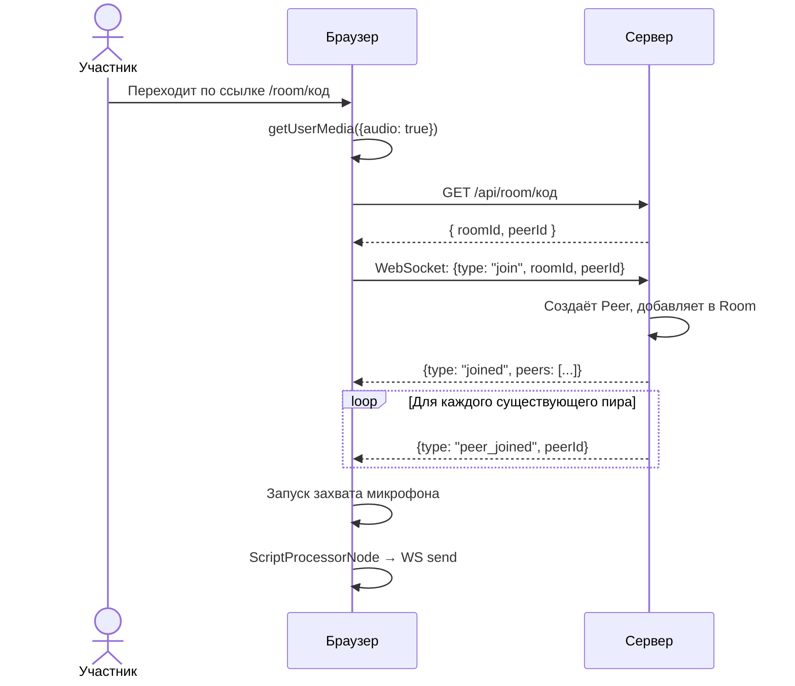

**Описание:** Браузер запрашивает доступ к микрофону, подключается к серверу через WebSocket, получает список участников и уведомления о присоединившихся пирах.

---

## 4. Диаграмма последовательности — передача голоса

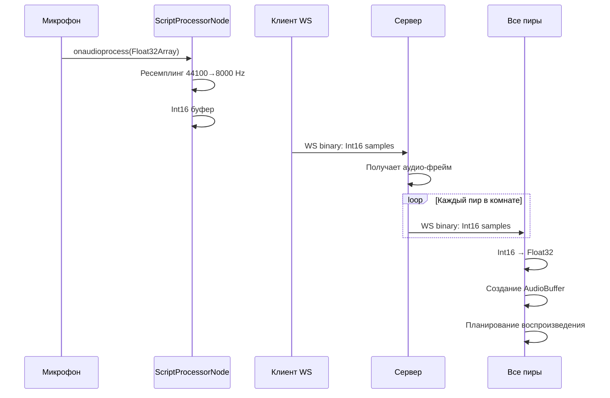

**Описание:** Микрофон захватывает звук, ScriptProcessorNode ресемплирует до 8 кГц, кодирует в Int16 и отправляет через WebSocket. Сервер ретранслирует всем остальным пирам.

---

## 5. Диаграмма последовательности — чат

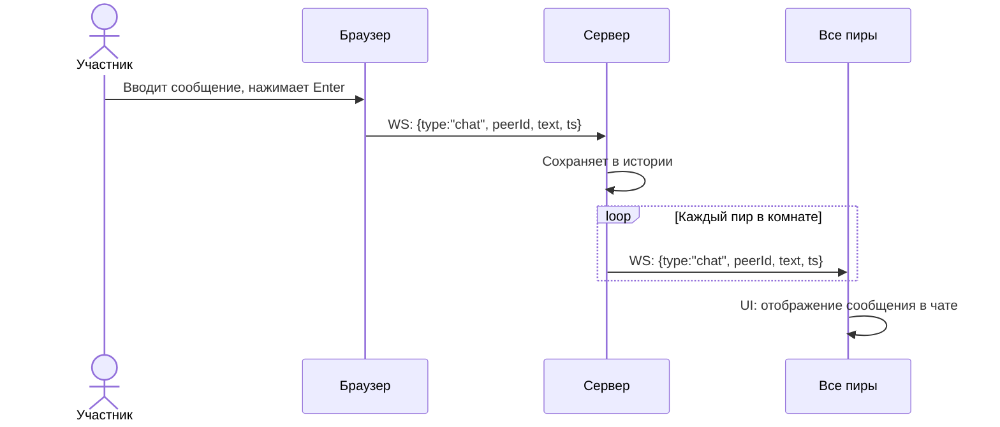

**Описание:** Участник отправляет текстовое сообщение через WebSocket. Сервер ретранслирует его всем участникам комнаты, которые отображают сообщение в интерфейсе чата.

---

## 6. Диаграмма последовательности — загрузка файла

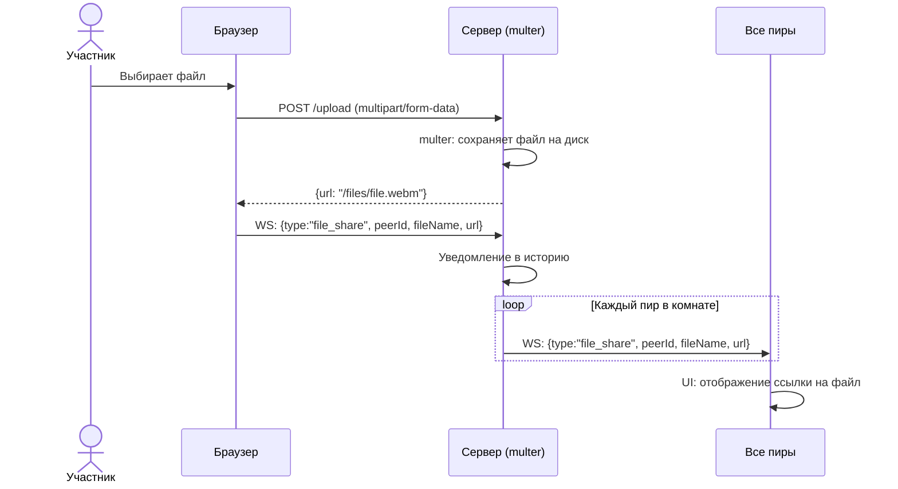

**Описание:** Участник загружает файл через HTTP POST с multipart/form-data. Сервер сохраняет файл и рассылает ссылку на него всем участникам комнаты через WebSocket.

---

## 7. Диаграмма последовательности — выход из комнаты

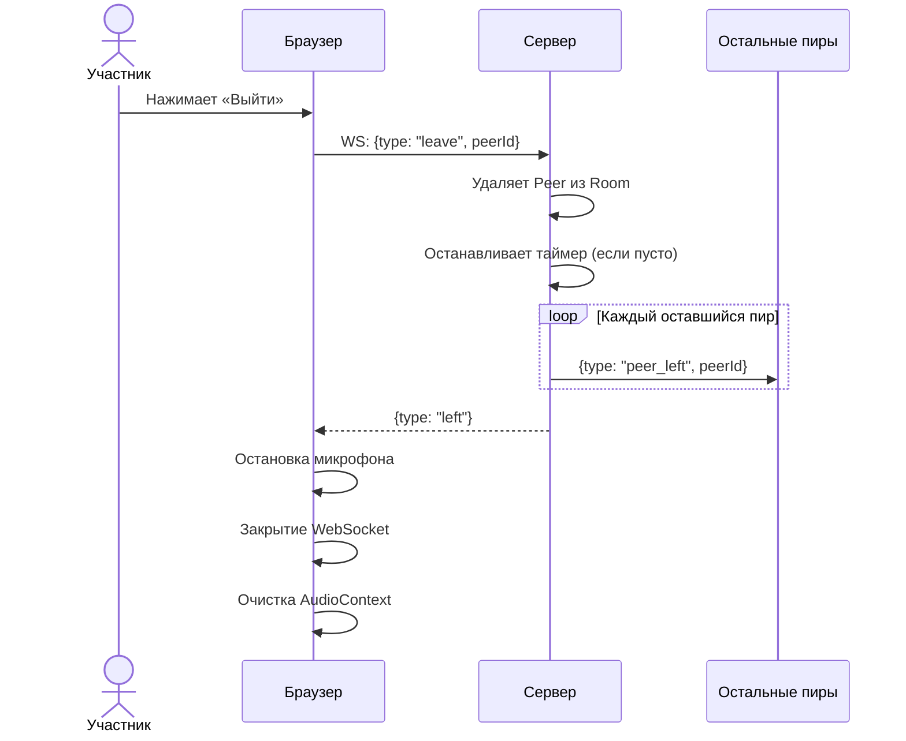

**Описание:** Участник нажимает кнопку выхода. Сервер удаляет пира из комнаты, уведомляет остальных и закрывает соединение. Клиент останавливает захват аудио и освобождает ресурсы.

---

## 8. Диаграмма состояний — жизненный цикл комнаты

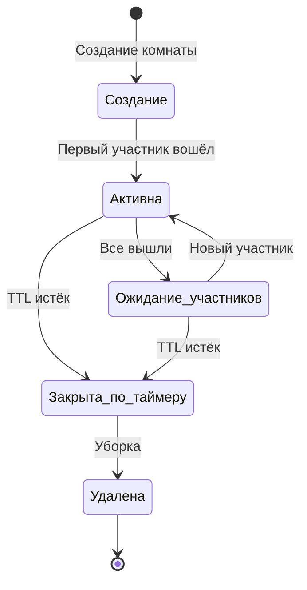

**Описание:** Комната создаётся при первом входе, становится активной, переходит в ожидание, когда все выходят. По истечении TTL комната закрывается и удаляется.

---

## 9. Диаграмма состояний — подключение участника

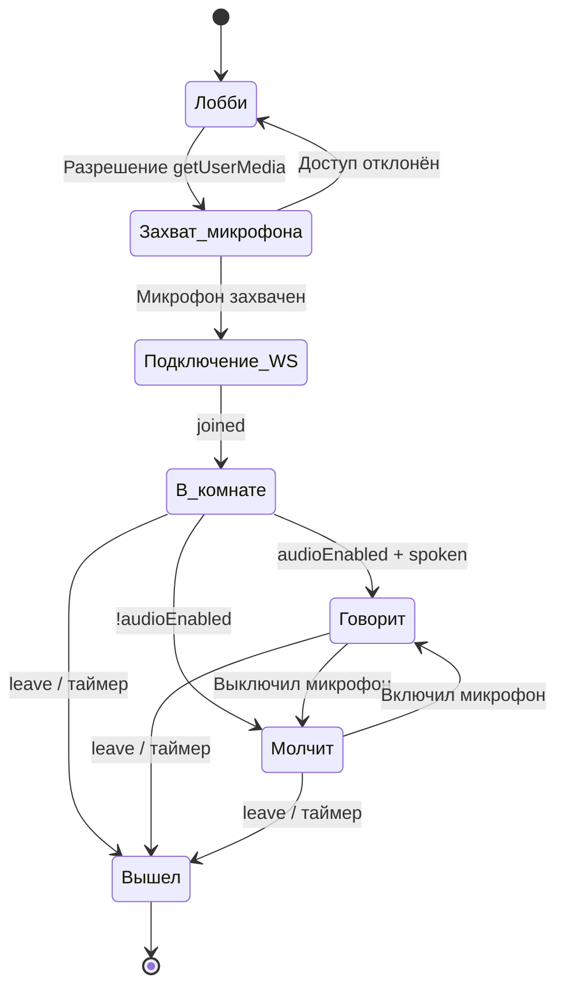

**Описание:** Участник проходит через лобби, захват микрофона, подключение к WebSocket. В комнате может говорить или молчать, затем выходит.

---

## 10. Диаграмма состояний — аудио процесс

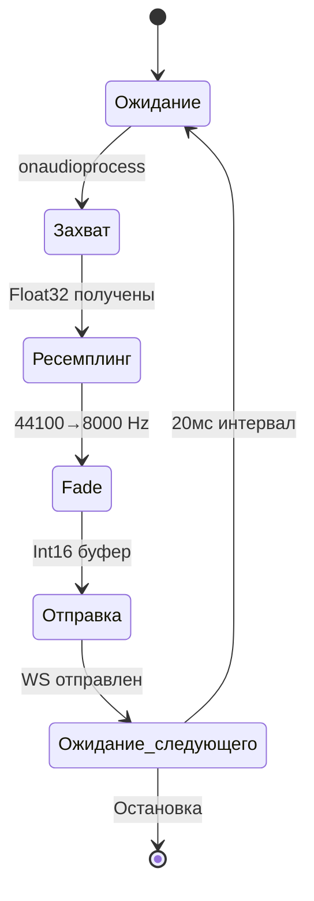

**Описание:** Цикл обработки аудио: захват буфера с микрофона, ресемплинг до 8 кГц, применение fade-in/out, отправка через WebSocket и ожидание следующего фрейма.

---

## 11. Диаграмма компонентов (Component Diagram)

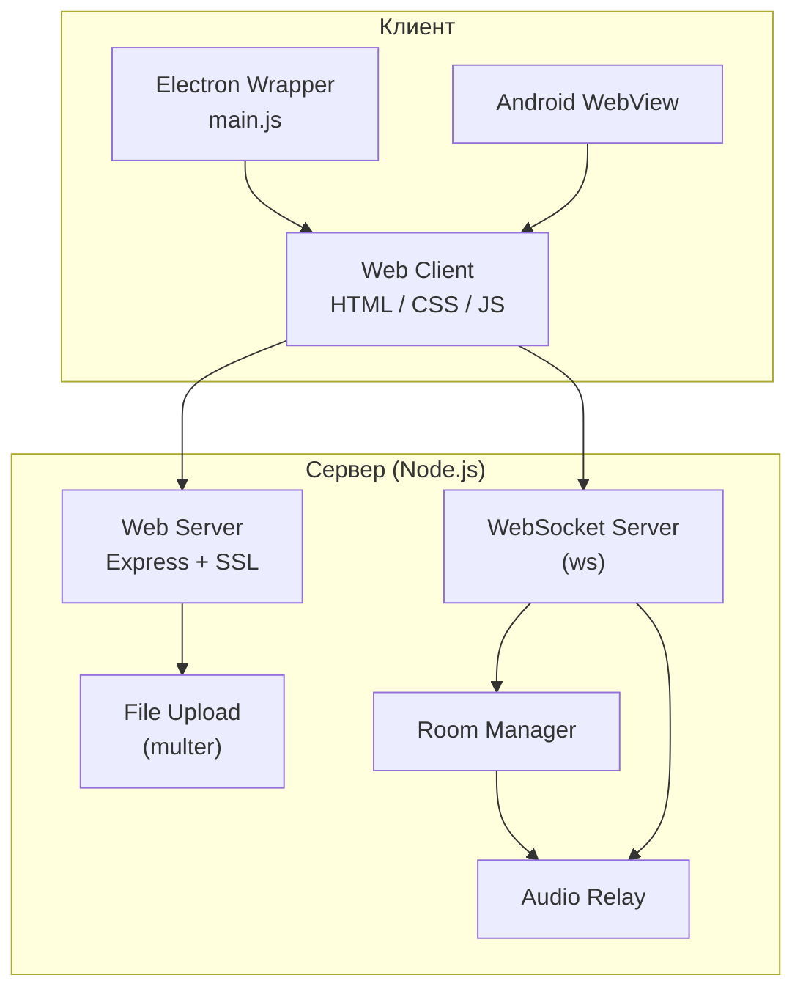

**Описание:** Сервер включает HTTP-сервер (Express), WebSocket-сервер (ws), менеджер комнат, загрузку файлов (multer) и ретрансляцию аудио. Клиенты: браузерный Web Client, Electron и Android WebView.

---

## 12. Диаграмма развёртывания (Deployment Diagram)

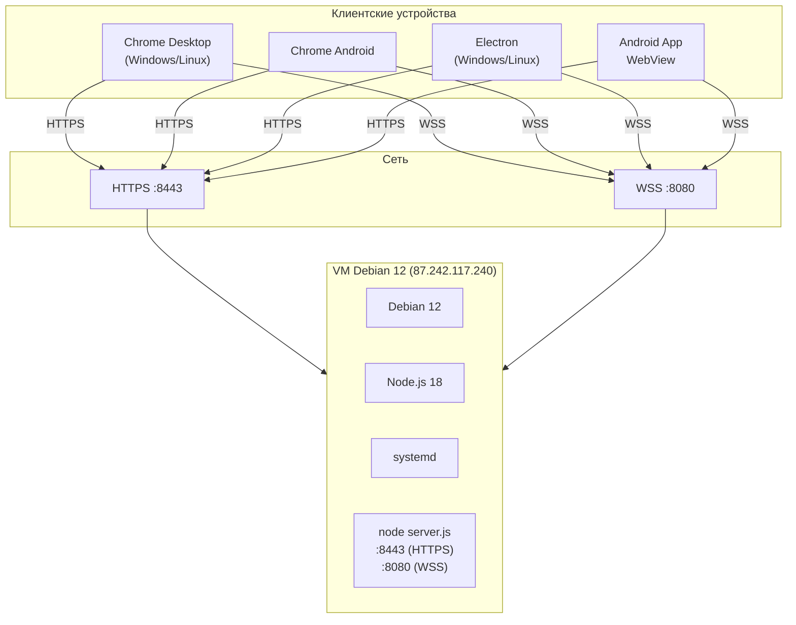

**Описание:** Сервер развёрнут на VM Debian 12 с Node.js 18 и systemd. Клиенты подключаются через HTTPS (8443) и WSS (8080). Поддерживаются Chrome Desktop, Chrome Android, Electron и Android App.

---

## 13. Диаграмма потоков данных (DFD Level 0)

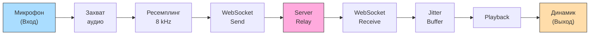

**Описание:** Поток данных от микрофона к динамику: захват аудио, ресемплинг до 8 кГц, отправка через WebSocket, ретрансляция сервером, приём, jitter-буфер и воспроизведение.

---

## 14. Диаграмма пакетов (Package Diagram)

```mermaid
graph TB
    subgraph PKG1 ["server/"]
        SJ["server.js"]
        PJ["package.json"]
        PJ2["package-lock.json"]
    end

    subgraph PKG2 ["web/"]
        IH["index.html"]
        CSS["css/"]
        JS["js/"]
    end

    subgraph PKG3 ["web/js/"]
        APP["app.js"]
    end

    subgraph PKG4 ["desktop/"]
        MJ["main.js"]
        PJ3["package.json"]
    end

    subgraph PKG5 ["android/"]
        AN["app/"]
    end

    subgraph PKG6 ["docs/"]
        UML["uml/"]
        GOST["gost/"]
    end

    PKG1 ..> PKG2 : отдаёт HTML/JS
    PKG2 --> PKG3
    PKG4 ..> PKG1 : подключается
    PKG5 ..> PKG2 : WebView
    PKG6 ..> PKG1 : документация
```

**Описание:** Пакетная структура проекта: `server/` — серверная часть, `web/` — клиентская (HTML, CSS, JS), `desktop/` — Electron, `android/` — Android-приложение, `docs/` — документация.

---

## 15. Диаграмма activities — обработка аудио-фрейма

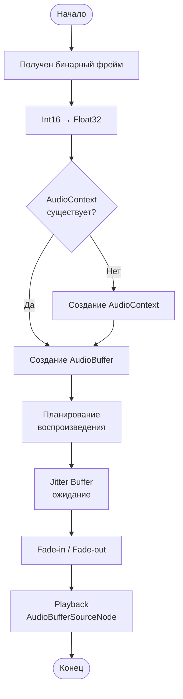

**Описание:** При получении бинарного фрейма данные конвертируются из Int16 в Float32, проверяется наличие AudioContext, создаётся AudioBuffer, планируется воспроизведение через jitter-буфер с fade-in/out.
